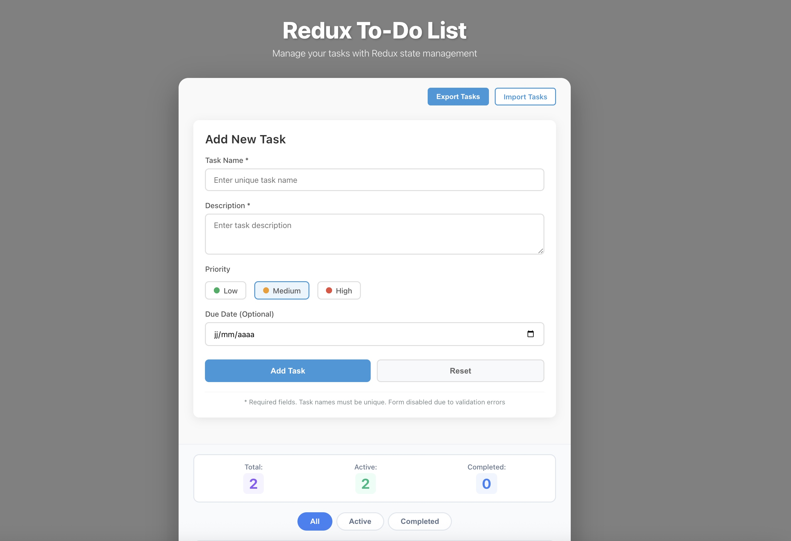
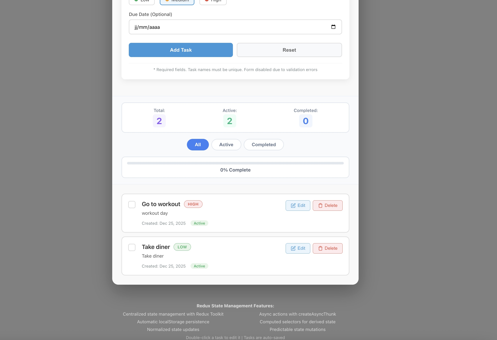

# Redux To-Do List Application

A feature-rich To-Do List application built with React and Redux Toolkit for state management.





## Features

### Core Features
- **Redux State Management**: Centralized state with Redux Toolkit
- **Add Tasks**: Create tasks with name, description, priority, and due date
- **Edit Tasks**: Double-click any task to edit its details
- **Delete Tasks**: Remove tasks with confirmation
- **Mark Complete**: Toggle task completion status
- **Form Validation**: Real-time validation with duplicate prevention
- **Local Storage**: Automatic persistence using localStorage

### Advanced Redux Features
- **Async Thunks**: Async operations with createAsyncThunk
- **Selectors**: Memoized selectors for derived state
- **Redux DevTools**: Full Redux DevTools integration
- **Normalized State**: Predictable state updates
- **Slice Pattern**: Organized with Redux To olkit slices

### Additional Features
- **Task Filtering**: Filter by All, Active, or Completed
- **Task Sorting**: Sort by priority or due date
- **Due Dates**: Set optional due dates with urgency indicators
- **Import/Export**: Backup and restore tasks from JSON
- **Statistics**: Real-time progress tracking
- **Responsive Design**: Mobile-friendly interface

## How to Run Locally

### Prerequisites
- Node.js (version 14 or higher)
- npm or yarn package manager

### Installation Steps

1. **Clone or download** the project files.

```
git clone https://github.com/alban-okoby/react_gmc_redux.git

```


2. **Navigate to the project directory**:
```bash
   cd todo-list-redux
```

3. **Install dependencies && run the project **
```bash
   npm i && npm run start
```
Go to http://localhost:3000 in your browser

Have a nice coding <\>
